# **Índice de Diagramas**

## *assignExpr*

## *assignOp*
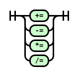

## *closedStmt*
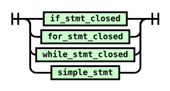

## *expr*

## *expr1*
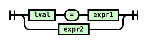

## *expr2*

## *expr3*

## *expr4*
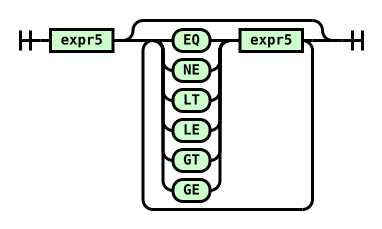

## *expr5*
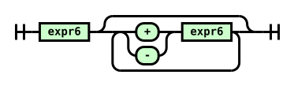

## *expr6*
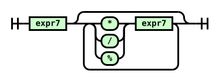

## *expr7*

## *expr8*
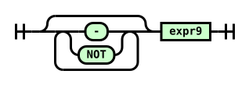

## *expr9*

## *forHeader*

## *forStmtClosed*

## *forStmtOpen*

## *group*
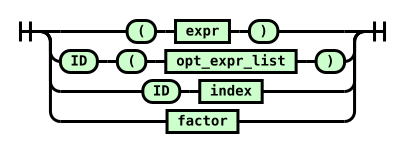

## *ifStmtClosed*

## *ifStmtOpen*

## *if_cond*

## *incdecExpr*
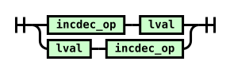

## *incdecOp*
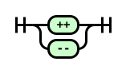

## *lval*

## *lvalue*

## *openStmt*
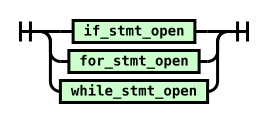

## *simpleStmt*
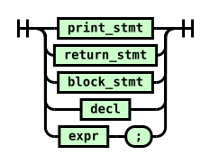

## *stmt*
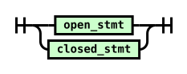

## *typeArray*
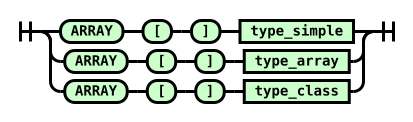

## *typeArraySized*
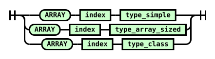

## *typeClass*

## *typeFunc*
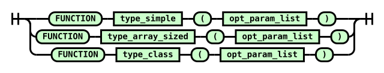

## *whileStmtClosed*

## *whileStmtOpen*

